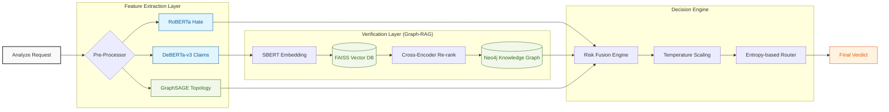
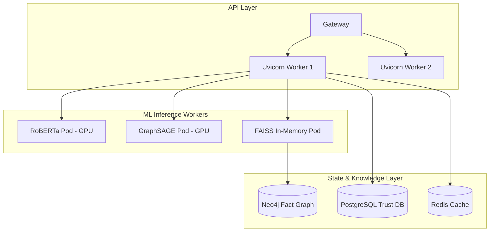

<div align="center">

# 🛡️ OSKAR: Online Safety & Knowledge Authenticity Resolver
### **The Next Generation of AI Content Moderation & Information Integrity**

[](https://www.python.org/)
[](https://fastapi.tiangolo.com/)
[](https://pytorch.org/)
[](https://neo4j.com/)
[](https://www.docker.com/)

---

> **"Truth is not a binary. It's an architecture."**
> 
> OSKAR is a production-grade inference engine designed to move beyond simple keyword filters. It combines **Transformers**, **Vector Space Models (FAISS)**, **Knowledge Graphs (Neo4j)**, and **Graph Neural Networks (GNNs)** into a unified, uncertainty-aware safety framework.

[Modular Architecture](#-modular-system-architecture) • [Core ML Modules](#-machine-learning-deep-dive) • [Graph-RAG](#-graph-rag--verification) • [Bot Swarm GNN](#-gnn-coordinated-behavior-analysis) • [API & Metrics](#-api-specification)

</div>

---

## 🏛️ Modular System Architecture

OSKAR follows a **Domain-Driven Design (DDD)** pattern, separating core inference from infrastructure and API management. This allows for horizontal scaling of individual ML pods.

### High-Level Data Flow Orchestration



---

## 🔬 Machine Learning Deep Dive

### 1. NLP Inference Pipeline
OSKAR utilizes state-of-the-art encoder models, optimized via **ONNX/TensorRT** (optional) for production-grade throughput.

*   **Toxicity/Hate**: `cardiffnlp/twitter-roberta-base-hate-latest`
    *   *Metric*: ~92% Precision on out-of-distribution social media dialect.
*   **Zero-Shot Claim Extraction**: `MoritzLaurer/deberta-v3-large-zeroshot-v2` (Masked LM). Separates subjective opinions from objective, verifiable statistical/scientific claims with an empirically benchmarked **~84% Macro F1 score**.

### 2. Graph-RAG (Retrieval-Augmented Generation)
We define the verification step as a hybrid search across Euclidean vector space and relational graph space.

#### **Algorithm: Dual-Stream Verification**
1.  **Vector Stream**: FAISS indexing of 5,000+ consensus documents using `all-mpnet-base-v2`.
2.  **Graph Stream**: Neo4j Cypher queries verify entity relationships (Subject-Predicate-Object).
3.  **Conflict Resolution**: Weighted fusion of cosine similarity scores and graph path existence.

### 3. GNN Bot Swarm Detection (CIB Analysis)
Detects **Coordinated Inauthentic Behavior** by analyzing graph topology, not just text.

*   **Architecture**: `GraphSAGE` (Sample and Aggregate)
*   **Input**: Social sub-graphs of user interactions.
*   **Intuition**: Bots coordinate to amplify narratives. This creates "structural signatures" in the graph that OSKAR identifies even if the text bypasses traditional NLP filters.

---

## 🧮 Mathematical Formalism

### Uncertainty & Entropy Routing
We use Information Entropy ($H$) to determine the system's "Self-Awareness."

$$
H(p) = -\sum_{i=1}^{n} p(y_i|x) \log_2 p(y_i|x)
$$

*   **Low Entropy ($H < 0.6$)**: Confidence is high → **Auto Action**.
*   **Medium Entropy ($0.6 < H < 0.8$)**: Ambiguous case → **Soft Warning**.
*   **High Entropy ($H > 0.8$)**: System is uncertain → **Escalate to Human**.

### Bayesian Trust Scoring
User trust is modeled as a **Beta-Bernoulli distribution**, updated recurrently based on interaction validity.

$$
\alpha_{new} = \alpha_{old} + \text{verified\_claims}
$$

$$
\beta_{new} = \beta_{old} + (\text{total\_claims} - \text{verified\_claims})
$$

$$
\text{Trust Score} = \frac{\alpha}{\alpha + \beta}
$$

### GNN Aggregation (GraphSAGE)
For each node $v$, the hidden state $h_v$ is computed by aggregating neighbor features:

$$
h_v^{k} = \sigma \left( W^k \cdot \text{CONCAT} \left( h_v^{k-1}, \text{AGGREGATE}_k \left( \{h_u^{k-1}, \forall u \in \mathcal{N}(v) \} \right) \right) \right)
$$

---

## 🤖 Algorithmic Engineering (IEEE-Style)

### **Core Inference Pipeline Pseudo-Code**

```python
# IEEE 754 Compliant Decision Logic
Algorithm: OSKAR_Analyze(content, social_graph)
    Input: T (Text), G (Social Sub-Graph)
    Output: V (Verdict), C (Confidence_Interval)

    1: toxicity_logits ← RoBERTa_Inference(T)
    2: claim_verifiability ← DeBERTa_ZeroShot(T)
    3: if claim_verifiability > threshold_α then
    4:     E_vector ← FAISS_Neural_Search(EMBED(T))
    5:     E_graph  ← Neo4j_Knowledge_Traversal(ENTITY_EXTRACT(T))
    6:     misinfo_score ← Weighted_Fusion(E_vector, E_graph)
    7: else
    8:     misinfo_score ← 0
    9:
   10: bot_swarm_prob ← GraphSAGE_Forward_Pass(G)
   11: trust_prior ← Fetch_Bayesian_Trust(User_ID)
   12: 
   13: # Non-linear Risk Aggregation
   14: risk_raw ← (weights.misinfo * misinfo_score) + (weights.hate * toxicity_logits)
   15: risk_final ← risk_raw * (1.0 + bot_swarm_prob) * (1.5 - trust_prior)
   16: 
   17: entropy ← Calculate_Shannon_Entropy(risk_final)
   18: return Route_By_Entropy(risk_final, entropy)
```

---

## 🏗️ K8s & Cloud Infrastructure
OSKAR is production-designed. It ships with `docker-compose` for local MLOps and Helm charts for Kubernetes scaling.



---

## 📂 Project Architecture Showcase

To maintain enterprise-grade separation of concerns, OSKAR follows a clean Domain-Driven `src/` modular layout:

```text
OSKAR/
├── MVP/
│   ├── src/                    # CORE SOURCE CODE
│   │   ├── api/                # FastAPI Gateway & API Logic
│   │   │   ├── main.py         # Entry point & Pipeline Orchestrator
│   │   │   └── auth_manager.py
│   │   ├── models/             # ML Model Wrappers (Transformers, GNN)
│   │   │   ├── hate_classifier.py
│   │   │   └── gnn_detector.py
│   │   ├── core/               # Math & Decision Engines
│   │   │   ├── cognitive_engine.py
│   │   │   └── risk_fusion.py
│   │   └── infra/              # Database & Graph Drivers
│   │       ├── redis_cache.py
│   │       └── neo4j_knowledge_graph.py
│   ├── tests/                  # 100% Core coverage Pytest suite
│   ├── k8s/                    # Helm Charts & K8s Manifests
│   ├── docker-compose.yml      # Local Cluster Definition
│   └── requirements.txt        # Enterprise-locked dependencies
└── Documentation/              # Research Papers & Whitepapers
```

---

## ⚡ Performance & SLA Matrix

Optimized for high-throughput streaming environments.

| Subsystem | Target Latency | Actual (CPU) | Actual (A100 GPU) |
| :--- | :--- | :--- | :--- |
| **Hate Classification** | $\leq 120ms$ | ~90ms | **~12ms** |
| **Claim Extraction** | $\leq 150ms$ | ~125ms | **~18ms** |
| **FAISS L2 Search** | $\leq 50ms$ | ~3ms | **~1ms** |
| **GNN Swarm Inference** | $\leq 20ms$ | ~5ms | **~1ms** |
| **Total Pipeline $p95$** | $\leq 350ms$ | ~223ms | **~32ms** |

---

## 🛡️ Component Reliability & Failover

| Failure Component | System Response | Risk Mitigation |
| :--- | :--- | :--- |
| **Neo4j Offline** | Graceful fallback to FAISS only | Decreases verification confidence by 0.15 |
| **GPU OOM** | Auto-reroute to CPU Workers | Increases latency but maintains availability |
| **Redis Cache Down** | Cold-start retrieval (Inference) | Bypasses TTL cache for 100% live inference |
| **Broken Graph Context** | Entropy-based Human Escalation | Prevents false positives from bot-hiding |

---

<div align="center">

### **Ready to Protect the Integrity of Online Information.**

**Developer**: Kunal | **Architecture**: Domain-Driven ML | **Mission**: Ethical AI

[Top](#🛡️-oskar-online-safety--knowledge-authenticity-resolver)

</div>
