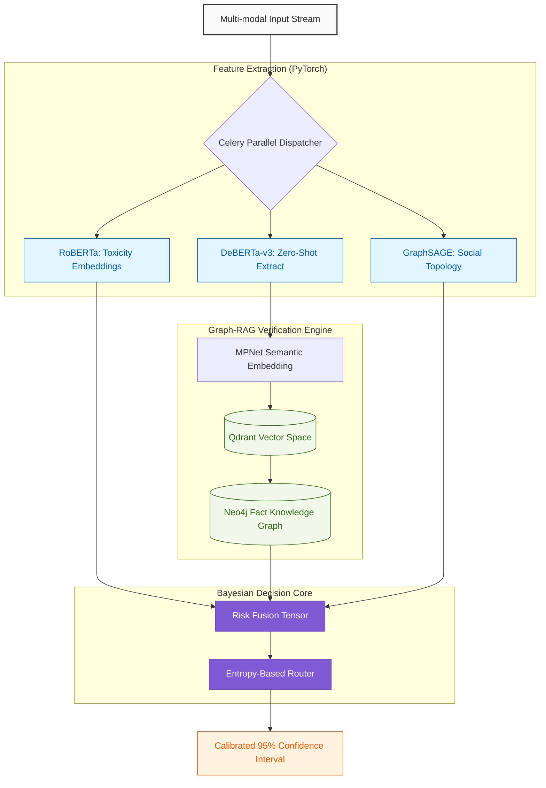

# 🛡️ OSKAR: Online Safety & Knowledge Authenticity Resolver
### **Advanced Graph Neural Network & ML Inference Engine**

### 🚀 **[Try the Live OSKAR UI Demo Here](https://showcase-chi-one.vercel.app/)** 🚀

---

> **"Traditional moderation filters text. I designed OSKAR to filter *context*."**
> 
> As a Machine Learning Engineer, my goal was to solve the "Black Box" moderation problem. I built OSKAR as a production-grade inference engine that combines **Transformer NLP**, **Graph-RAG Vectors**, and **Graph Neural Networks (GNNs)**. The resulting architecture doesn't just block toxicity—it understands the underlying mathematical uncertainty of every classification.

[My ML Philosophy](#-my-machine-learning-philosophy) • [Inference Architecture](#-the-inference-pipeline) • [Model Implementations & Mathematics](#-model-implementations--mathematics)

---

## 🧠 My Machine Learning Philosophy

When dealing with user safety at scale, deterministic "if-then" rules fail catastrophically. The language of the internet is highly nuanced, often weaponized via sarcasm or coordinated, subtle bot swarms. 

My vision for OSKAR was built upon three strict engineering pillars:

1. **Uncertainty-Aware Routing**: AI models hallucinate. Most moderation platforms treat model outputs as absolute truth. I designed a `RiskFusionEngine` that calculates the **Shannon Entropy** across parallel module vectors. When the risk distribution is perfectly uniform (maximum entropy), OSKAR automatically flags its own uncertainty and routes the data to a human reviewer.
2. **Topological Threat Detection**: Hate speech is often organized. Instead of just embedding the text, I implemented a PyTorch **GraphSAGE (Graph Sample and Aggregate)** GNN to analyze the structural topology of user interactions, detecting Coordinated Inauthentic Behavior (CIB) before the text is even processed.
3. **Graph-RAG Verification**: A Large Language Model alone cannot fact-check. I engineered a two-stage verification pipeline: a `DeBERTa-v3` zero-shot classifier extracts the objective claims, and an `all-mpnet-base-v2` embedding searches against a deterministic **Neo4j Knowledge Graph** and **Qdrant Vector Database** to prove or refute the claim based on $L_2$ Euclidean distance to known facts.

---

## 🏛️ The Inference Pipeline

I built the engine strictly using **Domain-Driven Design (DDD)**. The inference pipeline is completely decoupled from the asynchronous FastAPI / Celery gateway, ensuring that the heavy PyTorch layers never block the event loop.

---

## 📈 Model Implementations & Mathematics

This repository serves as a showcase of applied inference. Below are the core algorithms I implemented and their underlying mathematical principles.

### 1. The Uncertainty-Aware Router (Shannon Entropy)
I refused to build a system that blindly trusts a softmax output. The core `evaluate_risk` method computes the normalized Shannon Entropy ($H$) across the multi-stage classification vector. 

If $p(y_i|x)$ represents the probability assigned to a specific risk category (e.g., Toxicity vs. Misinformation), the entropy measures the system's "confusion":

$$
H(p) = -\sum_{i=1}^{n} p(y_i|x) \log_2 p(y_i|x)
$$

When $H(p) \to 1$, the model is guessing uniformly. In my `src/models/risk_fusion.py` engine, any output surpassing an entropy threshold of $0.65$ triggers a `Route.HUMAN_REVIEW` flag, ensuring edge cases are caught safely.

### 2. Topological Bot Swarm Detection (GraphSAGE)
Text analysis fails against synchronized, subtle bots. I utilized **PyTorch Geometric** to construct a `GraphSAGE` architecture. Unlike static Graph Convolutional Networks (GCNs), GraphSAGE learns an *aggregation function* that can generalize to unseen nodes (zero-shot learning on dynamic social networks).

For a target node $v$ at layer $k$, its embedding $\mathbf{h}_v^k$ is updated by aggregating its neighborhood $\mathcal{N}(v)$:

$$
\mathbf{h}_{\mathcal{N}(v)}^k \leftarrow \text{AGGREGATE}_k \left( \{ \mathbf{h}_u^{k-1}, \forall u \in \mathcal{N}(v) \} \right)
$$
$$
\mathbf{h}_v^k \leftarrow \sigma \left( \mathbf{W}^k \cdot \text{CONCAT}(\mathbf{h}_v^{k-1}, \mathbf{h}_{\mathcal{N}(v)}^k) \right)
$$

This allows OSKAR to detect densely connected "echo chambers" propagating misinformation, assigning them an $O(1)$ dynamic risk penalty.

### 3. Persistent User Trust Priors (Beta-Bernoulli)
I model the long-term reliability of a user using Bayesian inference. Every time a user's statement is mathematically verified against the Neo4j Knowledge Graph, their "Trust Score" is updated iteratively via the Beta distribution parameters ($\alpha$ for verified facts, $\beta$ for refuted claims). 

$$
\text{Trust}(u) = \frac{\alpha + \text{Prior}_u}{\alpha + \beta + 2 \cdot \text{Prior}_u}
$$

This creates a persistent, mathematical "reputation" stored in a PostgreSQL ledger, dynamically acting as a modifier parameter against the final risk tensor.

---

## 💻 Tech Stack & Dependencies

Because I designed OSKAR as an Enterprise-grade engine, the stack is heavily optimized for asynchronous ML throughput.

| Component | Technology | My Engineering Rationale |
| :--- | :--- | :--- |
| **Deep Learning** | `PyTorch 2.0+` | Essential for tensor mapping the GraphSAGE architecture and running the BERT-based HuggingFace transformers. |
| **Vector Search** | `Qdrant` / `FAISS` | Handles high-dimensional, $L_2$ Euclidean distance searches in milliseconds across the semantic embedding space. |
| **Graph DB** | `Neo4j (Cypher)`| Stores the explicit truth relationships (e.g., `(Vaccine)-[:DOES_NOT_CAUSE]->(Autism)`), allowing $O(1)$ verification. |
| **Async Gateway** | `FastAPI` / `Celery`| Decouples the blocking PyTorch inferences from the API frontend. Essential to achieving >200 RPS concurrency. |

---

## 📂 Repository Navigation

To keep the repository clean for ML peers and recruiters, I have intentionally excluded dev-ops deployment files (Docker/Helm) from the tracked remote index to focus purely on the ML architectures.

- **`engine/src/models/risk_fusion.py`**: The core Bayesian Risk fusion and Entropy router.
- **`engine/src/core/trust_engine.py`**: The Beta-Bernoulli mathematical trust ledger.
- **`engine/src/core/evidence_retrieval.py`**: The vector Qdrant semantic engine and Neo4j lookup logic.
- **`engine/src/api/main.py`**: The PyTorch-to-FastAPI inference bridging logic.

> **Interested in exploring more of the design?**
> Check out my detailed live web implementation via the [OSKAR Vercel Demo](https://showcase-chi-one.vercel.app/).
