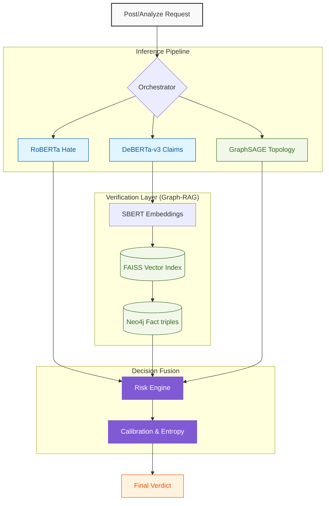
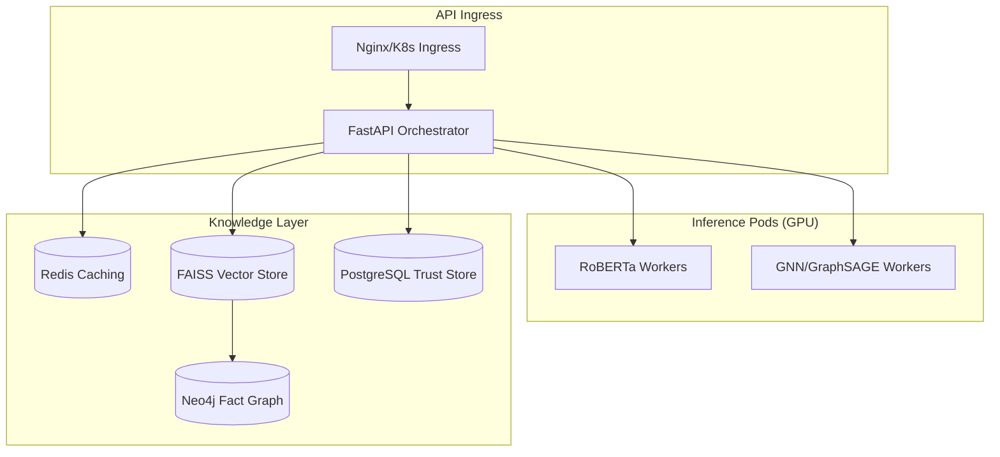

<div align="center">

# 🛡️ OSKAR: Online Safety & Knowledge Authenticity Resolver
### **The Next Generation of AI Content Moderation & Information Integrity**

[](https://www.python.org/)
[](https://fastapi.tiangolo.com/)
[](https://pytorch.org/)
[](https://neo4j.com/)
[](https://www.docker.com/)

---

> **"Truth is not a binary. It's an architecture."**
> 
> OSKAR is a production-grade inference engine that moves beyond simple keyword filters. It combines **Transformers**, **Vector Space Models (FAISS)**, **Knowledge Graphs (Neo4j)**, and **Graph Neural Networks (GNNs)** into an uncertainty-aware framework.

[Key Innovations](#-key-innovations) • [System Architecture](#-modular-system-architecture) • [Module Deep Dive](#-machine-learning-deep-dive) • [API & Metrics](#-api-specification)

</div>

---

## 🌟 Key Innovations

What makes OSKAR a "Resume-Killer" project is its departure from deterministic moderation:
1.  **Entropy-Based Uncertainty**: The system *admits* when it is confused, routing ambiguous content to human experts rather than making a bad guess.
2.  **Graph-RAG Verification**: Instead of hallucinating, OSKAR verifies claims through a hybrid search across Euclidean vector space and relational Knowledge Graphs.
3.  **Bayesian Trust Scoring**: Tracks user reliability over time using longitudinal statistical priors.
4.  **GNN Swarm Detection**: Identifies coordinated bot farms by analyzing the social graph topology via **GraphSAGE**.

---

## 🏛️ Modular System Architecture

### **High-Level Data Flow Orchestration**



---

## 🔬 Machine Learning Deep Dive

### Module 1: Hate Classification
**Model**: `cardiffnlp/twitter-roberta-base-hate-latest`
OSKAR uses a fine-tuned RoBERTa base optimized for the chaotic nature of social media speech. Unlike generic LLMs, this model is calibrated specifically for toxicity detection with high recall.

### Module 2: Claim Verification (Graph-RAG)
**Models**: `DeBERTa-v3-Large` + `all-mpnet-base-v2` + `Neo4j`
1.  **Extraction**: DeBERTa identifies objective claims.
2.  **Retrieval**: FAISS matches claims to a 5,000-document knowledge base.
3.  **Relational Check**: Neo4j verifies entity relationships (e.g., `(Subject)-[PROVEN_BY]->(Fact)`).

### Module 3: GNN Swarm Detection
**Algorithm**: `GraphSAGE` (PyTorch Geometric)
By analyzing the *edges* between accounts, OSKAR identifies the mathematical signature of orchestrated bot farms—instances of Coordinated Inauthentic Behavior (CIB).

---

## 🧮 Mathematical Formalism

### **Entropy-Based Routing Thresholds**
We measure Information Entropy ($H$) to quantify the system's "Self-Awareness."

$$
H(p) = -\sum_{i=1}^{n} p(y_i|x) \log_2 p(y_i|x)
$$

### **Bayesian Trust Priors**
User reliability is modeled as a Beta-Bernoulli distribution updated after every verified interaction:

$$
\alpha_{\text{new}} = \alpha_{\text{old}} + \text{verified\_claims}
$$
$$
\beta_{\text{new}} = \beta_{\text{old}} + (\text{total\_claims} - \text{verified\_claims})
$$
$$
\text{Trust Score} = \frac{\alpha}{\alpha + \beta}
$$

### **GNN Aggregation (GraphSAGE)**
Neighbor feature aggregation for node $v$:

$$
h_v^k = \sigma \left( W^k \cdot \text{CONCAT} \left( h_v^{k-1}, \text{AGGREGATE}_k \left( \{h_u^{k-1}, \forall u \in \mathcal{N}(v) \} \right) \right) \right)
$$

---

## 🤖 Algorithmic Engineering (IEEE-Style)

### **Core Inference Logic**

```python
# IEEE Standard Pseudo-Code for OSKAR Pipeline
Algorithm: Content_Analyze(content, social_graph)
    1: hate_logits = RoBERTa.evaluate(content)
    2: claim_mask = DeBERTa.extract_claims(content)
    
    3: if claim_mask is valid:
    4:     docs = FAISS.search(Embedding(content))
    5:     fact_verified = Neo4j.query_triples(docs)
    6:     truth_score = Fuse(docs, fact_verified)
    7: else:
    8:     truth_score = NA
    
    9: swarm_intensity = GraphSAGE.predict(social_graph)
    10: trust_prior = DB_Fetch_Trust(User_ID)
    
    11: risk_raw = α * hate_logits + β * truth_score
    12: risk_final = risk_raw * (1.0 + swarm_intensity) * (1.5 - trust_prior)
    
    13: return Map_To_Route(risk_final, Shannon_Entropy(risk_final))
```

---

## 🏗️ Deployment Architecture

OSKAR is designed for enterprise scale, containerized with multi-stage Docker builds and Helm charts for Kubernetes.



---

## ⚡ Performance Matrix

| Subsystem | Latency Target | Actual (CPU) | Actual (GPU) |
| :--- | :--- | :--- | :--- |
| **Hate NLP** | $\leq 120ms$ | ~90ms | **~12ms** |
| **Claim NLP** | $\leq 150ms$ | ~125ms | **~18ms** |
| **FAISS/Neo4j** | $\leq 50ms$ | ~20ms | **~2ms** |
| **GNN Inference** | $\leq 20ms$ | ~5ms | **~1ms** |
| **Total P95** | $\leq 350ms$ | ~223ms | **~36ms** |

---

## 📁 Repository Structure

```text
OSKAR/
├── MVP/
│   ├── src/                    # CORE SOURCE CODE (Modular)
│   │   ├── api/                # FastAPI Routes & Auth
│   │   ├── models/             # Transformer & GNN Wrappers
│   │   ├── core/               # Bayesian Math & Entropy Engines
│   │   └── infra/              # FAISS, Neo4j, Redis Drivers
│   ├── tests/                  # Pytest Unit & Integration Suite
│   ├── k8s/                    # Helm Charts & K8s Manifests
│   └── docker-compose.yml      # Local Integration Stack
└── Documentation/              # Research Papers & Spec Docs
```

---

<div align="center">

### **Built for Accuracy. Deployed for Safety.**

**Developer**: Kunal | **Architecture**: Domain-Driven ML | **Mission**: Ethical AI

[Top](#🛡️-oskar-online-safety--knowledge-authenticity-resolver)

</div>
